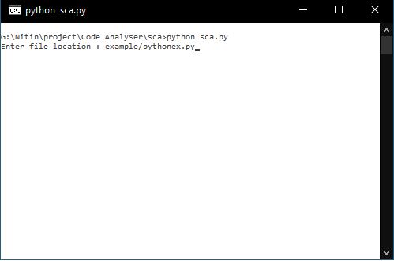
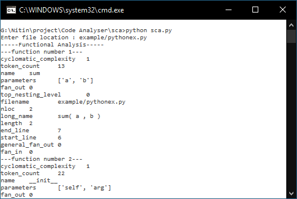
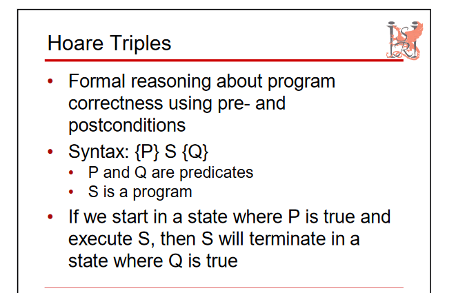
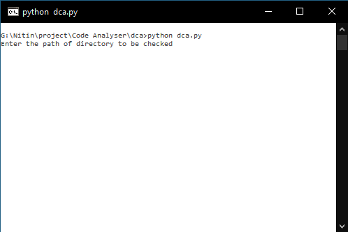
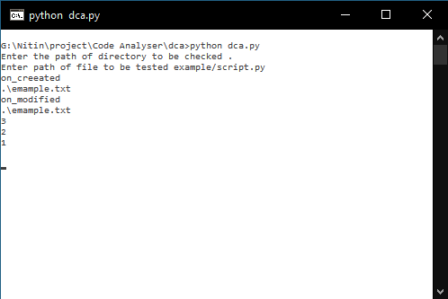

CODE ANALYSER
===================

Generally Code Analyser are of two types:

 1.  Static Code Analyser : In this the code is analysed without running it.
 2. Dynamic Code Analyser : In this the code is analysed by running it.

----------

### Table of contents

[TOC]

What it can do!!
-------------

This code analyser is capable of performing both static and dynamic analysis.

> **In Static Code Analysis**

> - It is capable of calculating cyclomatic complexity, nloc, fan-in, fan-out, nesting level, token_count etc which gives the fair idea of the effectiveness of the code.
> - It is also capable of identifying some possible and warnings.

> **In Dynamic Code Analysis**

> - It can detetct the changes made to the other files and directories by the program running.
> - It also gives the facility of time travel debugging i.e the user can check the value of any variable at any point of time.

Usage Guide
-------------

 - For Static Analysis run `sca.py` at `...\Code Analyser\sca`
 - For dynamic Analysis run `dca.py` at `...\Code Analyser\dca`
 - More detail are given in `How to use` in `For developer` section

For Developer
-------------
Python 2.x (only)
This Code Analyser conatins four parts :

 1. Static Analysis Variables ( nloc, token count etc)
 2. Error detection
 3. Change detection
 4. Time travel debugger
####  Static Analysis Parameters
Python package used :  [lizard ](https://pypi.python.org/pypi/lizard)
It gives the value of parameters like line of code(nloc), token count, fan-in. fan-out etc.

Python package used :  [lizard ](https://pypi.python.org/pypi/lizard)

##### How to use

> Enter file location
> 
>
> It will produce the output as shown
> 

####  Error detection
It is used for ckecking some specific errors and warnings present in the program.
For this first we have to make Abstract Syntax Tree (AST) for the code . Python package used for converting code to AST for different languages are:

 - [ast (for python)](https://docs.python.org/2/library/ast.html)
 - [plyj (for java)](https://pypi.python.org/pypi/plyj)
 - [slimit (for js)](https://pypi.python.org/pypi/slimit)

 For detectimg the error , [Hoare logic ](https://en.wikipedia.org/wiki/Hoare_logic) ( a[ formal method ](https://en.wikipedia.org/wiki/Formal_methods) technique is used.

##### Hoare Triple

More on this can be found [here](https://www.cs.cmu.edu/~aldrich/courses/654-sp07/slides/7-hoare.pdf)

##### Logic for detection of error
In this, we use Hoare triples to detect the error. Pre condition and post condition are invariants (invariants are the property of a program which remains same throughout the code)

i.e     {invariant} statement {invariant}

 - If this holds true i.e post condition satisfy invariant then code is error free
 - If post condition violates invariant then code might contain the error

###### Type mismatch error
Error => when  a variable of different data type is assign a value of different data type.

    Example =>
    int a;
    a="c";

  Logic => Let `type_dict` be a dictionary which contains variable name as  key and array of value of data type as value corresponding to the key.

> Example
> `a=10
> b=2
> c=a+b
> print(c)
> a="hello`
>for this dictionary `type_dict`  will be
>`type_dict={ "a" : ['int', 'string'],
>"b" : ['int'],
>  "c" : ['int']
>  } `

 - If in `type_dict` each key has only one element in its value array then there is no error,
 - If their is more than one element in the value array then there is error.

Invariant => Each key in `type_dict` has only one element in its value array

###### Null Pointer Exception
The process of establishing class invariants is :

    Let SI_candidate be the static class invariant
    candidate, SI be the static class invariant,
    NSI_candidate is non static class invariant candidate,
    NSI is a non static class invariant amd
    CI is class invariant
    Determine static invariants • Check all static fields for not null condition in
    master static paths, get SI_candidate; • Check all non static blocks, constructors and
    methods ( static and non static methods) to verify SI_candidate. If no method changes the candidate field to null then the field can be a member of SI. {SI_candidate} non static block {SI_candidate} {SI_candidate} constructor {SI_candidate} {SI_candidate} method {SI_candidate}
    Determine non static invariants • Use SI as precondition for checking all
    constructors to determine NSI_candidates. If all constructors initialize the field, we
    can establish it is a candidate of NSI. {SI} constructor {NSI_candidate} • Check all methods to verify
    NSI_candidates. If no method changes the candidate field to null then the field can
    be a member of NSI. {NSI_candidate} method {NSI_candidate}
    Class invariant CI = SI ∪ NSI

After we get the class invariants, we can use them to
detect potential null pointer violations. We need to
insert assertions {¬isNull(v)} at certain places
wherever a dereference of reference variable v is
attempted. We attempt to prove these assertions hold
with class invariants as the pre-condition of the
methods. If the proof fails, a potential violation is
detected.

Check Violation Program operations that may signal run-time errors during an execution are a star ting point in the static debugging process. By inspecting the invariants for the arguments of each program operation we can identify those program operations that can cause run-time errors and flag them for inspection by the programmer. The process for detecting a null pointer violation can be summarized as below: Let WC is the weakest pre condition ; V is any variable that is dereferenced
• Check all master static paths if ( {WC} => v != null) is not proved , there is a
potential null pointer violation. • Check all master constructor paths if ({SI} ∧ {WC} => v != null) is not proved, there is a potential null pointer violation. • Check all non-static methods, if ({SI} ∧ {CI}∧ {WC} => v != null) is not proved, there is a potential null pointer violation. Appropriate proof obligations are created for each statement in a given path where the field to be proved is dereferenced.

###### Function return error
Error => Function is returning but the on call it is not assign to any variable

    Exampe =>
    def sum(a,b) :
	    return (a+b)
    sum(2,3)
Logic => If function is returning something then add to an array `func_return_array`

 - On function call if the call def corresponds to the `assignment` and that function name is in the `func_return_array` then their is no error
 - On function call if the call def corresponds to the `assignment` and that function name is not in the `func_return_array` then their is error
 - On function call if the call def corresponds to the `expression` and that function name is in the `func_return_array` then their is error
 - On function call if the call def corresponds to the `expression` and that function name is not in the `func_return_array` then their is no error

###### Global variable used
Warning => Gloabl variable is being used in the program

    Exampe =>
    a = 10
    global b = a
Logic => if any varable is of gloabal type add it to array `is_gloabl`

 - If the array `is_global` is empty then generate no warning
 - If the array `is_global` is not empty then generate warning

#### Change detection
It is used for identifying the changes made on running the program.
It is available for python and node js but it can be extended for any other language if it can be called by a python script.

Python Package used : [Watchdog](https://pypi.python.org/pypi/watchdog)

#####How to use

> Enter path of directory which is to be checked for any changes
> 
> Enter path of file to be tested
> 
> Then it will produce the output
> 

####  Time travel debugger

It is used for checking the value of a variable at any point of time.
It is available only for the python.

##### How to use
OS = > Runs only in linux

Add `timetravelpdb.py` in your os at `Python27\Lib`

Add these code in top of your pyhton code

    import timetravelpdb
    timetravelpdb.set_trace()
Then enter the following commands :

 - n => for executing next statement
 - ulist => for listing the previous universe exist
 - ujump => for jumping to any existing universe
 - print {vaiable name} = > to check the value of the  variable name
 - uup => for coming back to current universe

